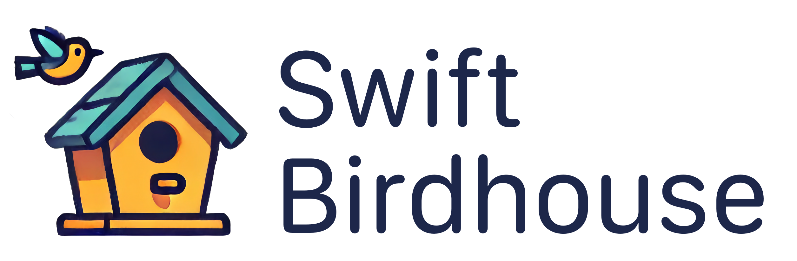

^ Presentation for CocoaHeads Melbourne, July 2024
url: https://www.youtube.com/live/XaXg9EilrQQ?si=ybRyap-WWnBh7lMw&t=545
Presentation rendered with [Deckset](deckset.com)

# Swift Registry
## Dependencies Outside of GitHub

### Marcelo Esperidiao, Engineer @ANZx
#### @marcelo@mastodon.au | linkedin.com/in/marceloes

^
Things to do before:
- Connect to internet
- Delete all rapid api exchenges
- Xcode with swift-figlet, clean
- Xcode with swift-birdhouse, clean
- Browser with
  - Figlet.org
  - github.com/marcelo-es/swell
- Terminal on
  - swift-birdhouse
  - swift-figlet
  - swell
  - run swift-birdhouse

---

# Swift Figlet 🎨

^
- Swift Figlet is a small application that prints Hello CocoaHeads in Ascii art
- Run the command to show what it does
- Show the source code
  - Uses a library called Swell (available on GitHub)
  - Explain the code

---

# Swift Figlet 🎨 → Swell 🌊 

---

---

# What if Swell 🌊 can't be on GitHub?

^
- What if you don't want the world to see it?
- What if it's not open source?

---
[.slide-transition: move(top)]
[.footer: (anvil animation goes here)]

# Swift Registry

^
- Publish to a locally-running swift registry
  `swift package-registry publish marcelo-es.swell 0.0.1 --url http://localhost:8080 --allow-insecure-http`
- Set the registry for marcelo-es in the local package
  `swift package-registry set http://localhost:8080 --scope marcelo-es --allow-insecure-http`
- Restart Xcode

---

# What sort of 🧙‍♂️ is this?

^
It's no witchery
Swift Registry has been implemented in SwiftPM since Swift 5.7 (Xcode 14)
It's has an online spec (show website)
SwiftPM has the tooling, but it's not the server

---

---

---

---

# Swift Registry is the spec, so where did Swell 🌊 go?

---
[.slide-transition: move(top)]
[.footer: (logo by ChatGPT)]

---

^
Implementation of the Swift Registry

---

# Swift Birdhouse
[.build-lists: true]

- Pure to the specs
- Built with Hummingbird 2 (`2.0.0-rc.1`)
- Has as few dependencies as we can get away with
- Blazing fast and light on runtime
- Not ready for production
  - yet!

---

# Show me 🪵!

^
Show logs on swift-birdhouse
Show intraction with RapidAPI
Also show Package.resolved

---

# Scopes?

^
Scopes give you means of having packages coming from different registries.

---
[.footer: `Package.swift`]

---
[.footer: `.swiftpm/configuration/registries.json`]

---
[.footer: `.swiftpm/configuration/registries.json`]

---

# What if dependencies conflict ⚔️?

---

 

---

---

^
Show RapidAPI tests

---

# Thanks! Questions?

---
